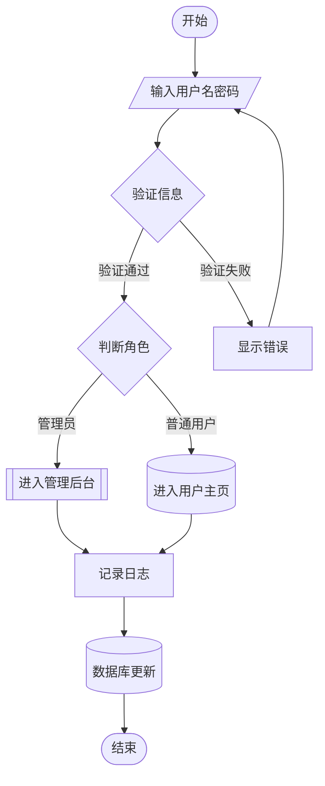

# typora 使用

## 插件

### 添加插件

https://github.com/obgnail/typora_plugin/tree/master#

```python
安装插件后，插入代码框后，右侧有复制按钮了
可以选择语言模式 比如python
太ok了
#include this.h

#this is a demo code

import
import numpy

a = 1
b = 2
# 代码块右上角写了 "python"，插件会激活
print("Hello, World!")


```

### Mermaid

typora自带mermaid. 输入·```mermaid 然后回车。




### 插入图片的方法

```html


```


### 注释

```html
<!-- 待办：这里的流程图逻辑需要核对一下 -->
这是正文内容，用户能看到。
```

<!--   -->

<!--Tong:0506 还需要修改其他的地方  -->

目前只能用单行的注释

这是正文内容，用户能看到。


## 常规使用

### 公式的插入

#### 公式模式

| 模式     | 写法                                | 示例       |
| -------- | ----------------------------------- | ---------- |
| 行内公式 | `$...$`                             | $E=mc^2$   |
| 行间公式 | `$$...$$`                           | $$E=mc^2$$ |
| 自动编号 | `\begin{equation}...\end{equation}` | (1)        |
| 手动编号 | `\tag{...}`                         | (自定义)   |

#### 常用符号

| 符号  | 命令          | 符号   | 命令                |
| ----- | ------------- | ------ | ------------------- |
| 上标  | `x^2`         | 下标   | `x_2`               |
| 分数  | `\frac{a}{b}` | 平方根 | `\sqrt{x}`          |
| n次根 | `\sqrt[n]{x}` | 括号   | `( )` `[ ]` `\{ \}` |

####  希腊字母

| 大写 | 命令     | 小写 | 命令     |
| ---- | -------- | ---- | -------- |
| Γ    | `\Gamma` | γ    | `\gamma` |
| Δ    | `\Delta` | δ    | `\delta` |
| Ω    | `\Omega` | ω    | `\omega` |
| π    | -        | π    | `\pi`    |
| θ    | -        | θ    | `\theta` |

#### 运算符

| 运算 | 命令    | 示例                                |
| ---- | ------- | ----------------------------------- |
| 求和 | `\sum`  | `\sum_{i=1}^n` → $\sum_{i=1}^n$     |
| 积分 | `\int`  | `\int_a^b` → $\int_a^b$             |
| 乘积 | `\prod` | `\prod_{i=1}^n` → $\prod_{i=1}^n$   |
| 极限 | `\lim`  | `\lim_{x \to 0}` → $\lim_{x \to 0}$ |

#### 关系与逻辑符号

| 符号 | 命令            | 符号 | 命令            |
| ---- | --------------- | ---- | --------------- |
| ≤    | `\le` 或 `\leq` | ≥    | `\ge` 或 `\geq` |
| ≠    | `\neq`          | ≈    | `\approx`       |
| ∀    | `\forall`       | ∃    | `\exists`       |
| ∈    | `\in`           | ∉    | `\notin`        |
| →    | `\to`           | ∞    | `\infty`        |

##### 矩阵与括号

```latex
\begin{pmatrix}
1 & 2 & 3 \\
4 & 5 & 6
\end{pmatrix}
```


